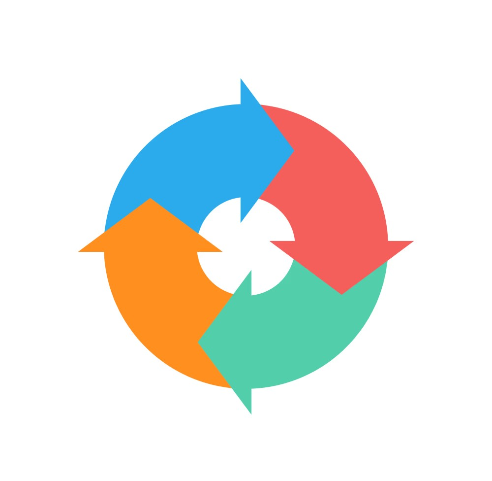

# 
--- Atul Tiwari: Architecting the Future ---

  

  <b>Full-Stack Developer | MERN Specialist | Generative AI Engineer</b>

  

---

## Professional Brief
-  **Currently Pioneering:** Deep-diving into **Generative AI** and high-concurrency pipelines.
-  **Specialized In:** Scaling **Microservices** and optimizing **Distributed Systems** (Kafka/Redis).
-  **Enhancing:** Advanced **System Design**, **GenAI Workflows**, and **Cloud Infrastructure**.
-  **Collaboration:** Open to innovative **Open Source** projects and AI-driven startups.
-  **Direct Reach:** [atult2620@gmail.com](mailto:atult2620@gmail.com)

---

##  Specialized Tech Ecosystem

### 💻 Frontend & UI Architecture

### ⚙️ Backend & Distributed Systems

### 🤖 AI & Data Persistence

---

##  Pinned Projects (The Techy Grid)

| 🟢 Project Alpha | 🔵 Project Beta |
| :--- | :--- |
|  |  |
|  |  

---"galaxy-ring-health-tacker-startframe-mo.jpg"

## 🌐 System Design & Infrastructure
<table border="0">
  <tr>
    <td width="50%">
      <h3>🛡️ Networking & Security</h3>
      <ul>
        <li><b>Protocols:</b> TCP/IP, OSI, HTTP/HTTPS, FTP</li>
        <li><b>Auth:</b> JWT, BCrypt, Identity Management</li>
        <li><b>APIs:</b> RESTful Services & GraphQL</li>
      </ul>
    </td>
    <td width="50%">
      <h3>🚀 DevOps & Cloud</h3>
      <ul>
        <li><b>Docker:</b> Containerization & Microservices</li>
        <li><b>Cloud:</b> AWS EC2, Vercel, Render</li>
        <li><b>Automation:</b> Linux & Bash Scripting</li>
      </ul>
    </td>
  </tr>
</table>

---

##  Programming Metrics

---

## 🐍 Activity Stream

---

##  Let's Connect!

  

  <i>"Code is like humor. When you have to explain it, it’s bad." – Atul Tiwari</i>

